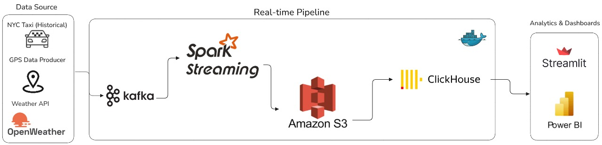
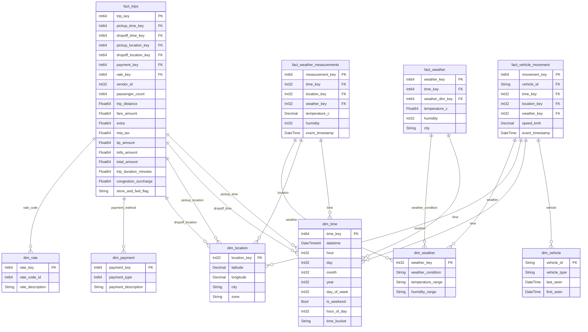

# RideTrack360

## Overview
RideTrack360 is an intelligent real-time analytics platform designed for ride-hailing and fleet management services in New York City. The system continuously ingests and processes live GPS tracking data from vehicles, real-time weather conditions, and NYC taxi trip information to deliver instant insights and operational intelligence. Built with cutting-edge streaming technologies, RideTrack360 empowers businesses with live fleet monitoring, demand forecasting, and revenue optimization capabilities.

## Architecture
 

## Key Features
-  **Real-time Vehicle Tracking** - Live GPS monitoring of 50+ vehicles with sub-second updates
- **Weather Intelligence** - Automated weather data integration for demand correlation analysis  
- **Live Analytics Dashboard** - Instant visibility into fleet performance and business metrics
- **Revenue Optimization** - Real-time fare analysis and pricing intelligence
- **Demand Forecasting** - Predictive analytics for trip demand patterns
- **High-Performance Processing** - Handles millions of data points with Kafka and Spark streaming
- **Cloud-Native Architecture** - Scalable infrastructure using AWS S3 and ClickHouse

## Data Model

The data warehouse follows a star schema with:
- **Fact Tables**: trips, vehicle_movement, weather
- **Dimension Tables**: time, location, vehicle, payment, rate, weather
- **Views**: Trip Analysis, Vehicle & Operational, Weather & Environmental,Real-time & Monitoring Views

### Data Warehouse Schema

## Streamlit Dashboard

The Streamlit dashboard provides a powerful and interactive interface for exploring the NYC taxi data, leveraging ClickHouse for high-performance analytics. It offers various insights into business operations, revenue, trip patterns, location analytics, operational metrics, customer behavior, and predictive trip analytics.

**Live Demo:** [https://adinsight360.streamlit.app/](https://adinsight360.streamlit.app/)
### Key Sections & Visualizations

Here are some of the key sections and example visualizations from the dashboard:

#### Business Overview 

#### Revenue Analysis 

#### Predictive Trip Analytics 

## SQL Queries

All the SQL queries used to power this Streamlit dashboard are consolidated in the `all_sql_queries.sql` file. This file is organized by dashboard section, making it easy to understand the data retrieval logic for each visualization. You can find queries for:

*   Business Overview
*   Revenue Analysis
*   Trip Patterns
*   Location Analytics
*   Operational Metrics
*   Customer Insights
*   Predictive Trip Analytics
*   Database Exploration (for understanding schema and data quality)

These queries are optimized for ClickHouse performance and demonstrate various analytical patterns, including aggregations, joins, and conditional logic.

## Documentation

>For detailed technical documentation, implementation guides, and API references  Check out the full project here: 
[RideTrack360 on DeepWiki](https://deepwiki.com/Anwaribra/RideTrack)

