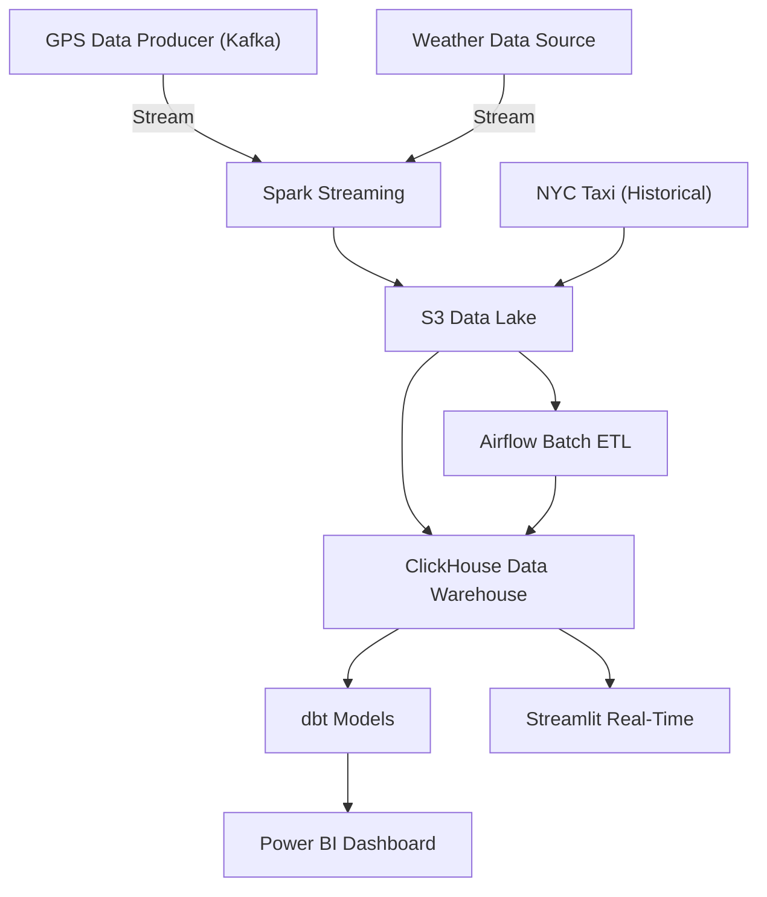

# RideTrack360

## Overview
RideTrack360 is a comprehensive big data analytics platform for ride-hailing services, focusing on New York City operations. It processes real-time GPS tracking, weather conditions, and historical taxi data to provide actionable insights and predictions. The platform features robust streaming and batch data pipelines, cloud-native storage, and advanced analytics, all orchestrated for reliability and scalability.

## Architecture

- Both streaming and batch pipelines share S3 Data Lake and ClickHouse Data Warehouse.
- The streaming pipeline flows from GPS/Weather → Spark Streaming → S3 → ClickHouse → Streamlit.
- The batch pipeline flows from NYC Taxi Data → S3 → Airflow → ClickHouse → dbt → Power BI.

