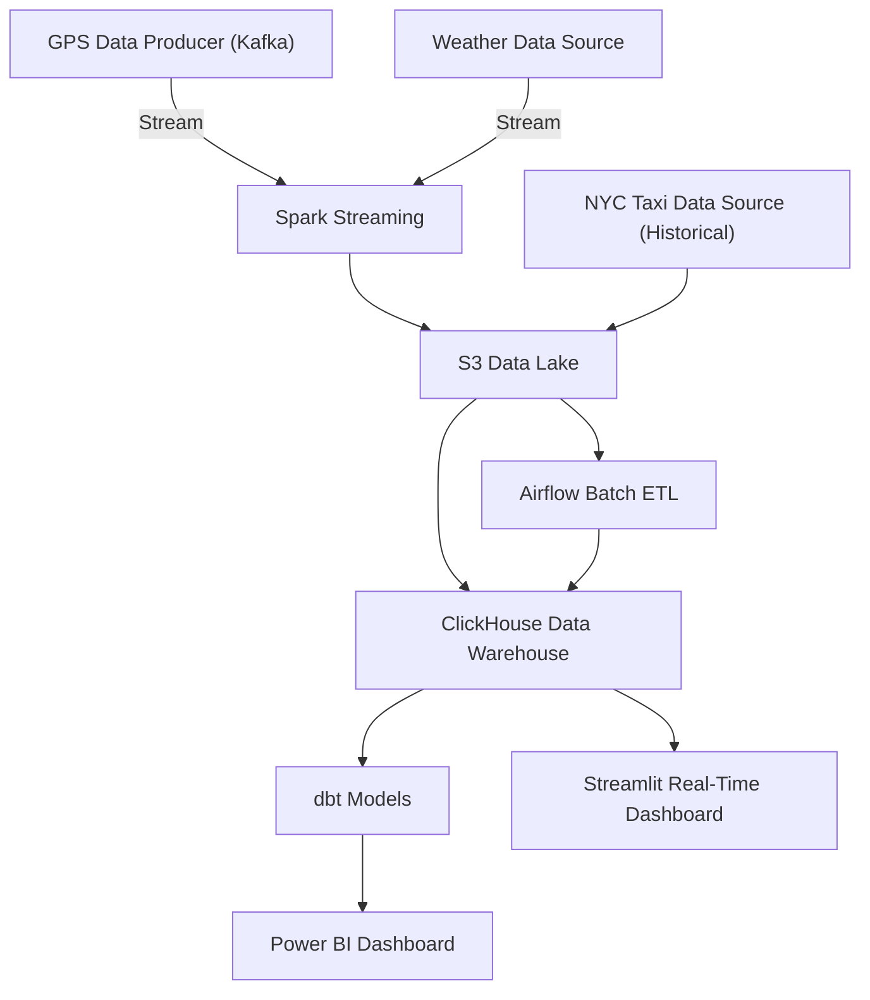

# RideTrack360

## Overview
RideTrack360 is a comprehensive big data analytics platform for ride-hailing services, focusing on New York City operations. It processes real-time GPS tracking, weather conditions, and historical taxi data to provide actionable insights and predictions. The platform features robust streaming and batch data pipelines, cloud-native storage, and advanced analytics, all orchestrated for reliability and scalability.

## Architecture

### Diagram Walkthrough

- Both streaming and batch pipelines share S3 Data Lake and ClickHouse Data Warehouse.
- The streaming pipeline flows from GPS/Weather → Spark Streaming → S3 → ClickHouse → Streamlit.
- The batch pipeline flows from NYC Taxi Data → S3 → Airflow → ClickHouse → dbt → Power BI.

### 1. Data Ingestion Layer
Three main data sources are processed through dedicated Python scripts:

#### Real-time Data Sources
1. **GPS Tracking** (`gps_data_producer.py`)
   - Simulates vehicle locations in NYC
   - Updates every 2 seconds
   - JSON format with vehicle ID, coordinates, speed
   - Streams to Kafka topic: `gps_topic`

2. **Weather Data** (`weather_api_ingest.py`)
   - Real-time NYC weather from OpenWeather API
   - Updates every 5 minutes
   - Temperature, conditions, humidity
   - Streams to Kafka topic: `weather_topic`

#### Batch Data Source
3. **NYC Taxi Data** (`nyc_taxi_ingest.py`)
   - Monthly historical trip data
   - Parquet files from NYC TLC
   - Automated download and S3 storage
   - Source: NYC Taxi & Limousine Commission

### 2. Data Processing & Orchestration

- **Stream Processing**: Apache Spark Structured Streaming
  - Consumes real-time GPS and weather data from Kafka
  - Integrates and processes streams for live metrics and anomaly detection
  - Writes processed stream data directly to Amazon S3 (data lake)

- **Batch Processing**: Apache Spark & dbt
  - Transforms historical taxi data and processed stream data
  - Feature engineering for ML and analytics
  - Batch jobs orchestrated via Airflow DAGs
  - dbt models build analytics-ready tables in Snowflake

- **Orchestration**: Apache Airflow
  - Manages end-to-end data workflows
  - Schedules and monitors both streaming and batch jobs
  - Automates data movement from S3 to Snowflake

### 3. Storage Solutions
- **Data Lake**: Amazon S3
  - Stores raw and processed data from both streaming and batch pipelines
  - Partitioned for efficient access and cost-effective storage

- **Data Warehouse**: Snowflake
  - Receives curated, analytics-ready data from S3
  - Supports fast, scalable SQL analytics and BI workloads

### 4. Analytics & ML
- **Real-time Analytics**
  - Vehicle tracking, demand patterns, weather impact analysis
  - Powered by live data from Spark streaming and S3

- **Predictive Models**
  - ETA predictions, demand forecasting, weather-based adjustments
  - Feature engineering and model training using batch data in Snowflake

### 5. Visualization
- **Real-time Dashboard**: Streamlit
  - Live maps, current metrics, active vehicle tracking

- **Analytics Dashboard**: Power BI
  - Historical trends, KPI tracking, custom reports

## Data Flow Summary
1. Real-time and batch data ingested via Python scripts and Kafka.
2. Spark Structured Streaming processes real-time data and writes to S3.
3. Batch jobs (historical and processed stream data) are orchestrated by Airflow, transformed by dbt, and loaded into Snowflake.
4. Analytics and dashboards consume data from Snowflake and S3 for insights and visualization.

## Technologies Used
- Python, Apache Kafka, Apache Spark (Structured Streaming & Batch)
- Amazon S3, Snowflake, dbt, Apache Airflow
- Streamlit, Power BI

## Getting Started
1. Set up Kafka, Spark, S3, and Snowflake accounts.
2. Configure Airflow DAGs for orchestration.
3. Run the data ingestion scripts for real-time and batch sources.
4. Use dbt to build and test models in Snowflake.
5. Launch Streamlit and Power BI dashboards for visualization.

## License
MIT
