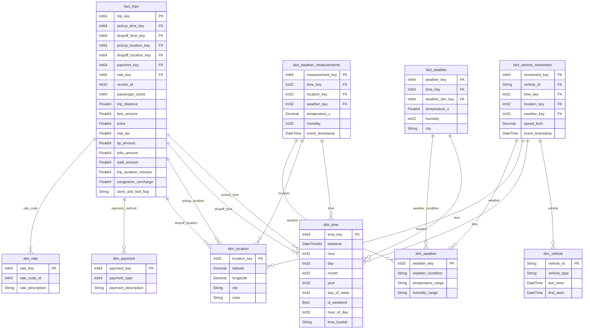

# RideTrack360 Data Warehouse

##  Data Model

The data warehouse follows a star schema with:
- **Fact Tables**: trips, vehicle_movement, weather
- **Dimension Tables**: time, location, vehicle, payment, rate, weather
- **Views**: Trip Analysis, Vehicle & Operational, Weather & Environmental,Real-time & Monitoring Views

### Data Warehouse Schema

###  Data Flow Architecture

